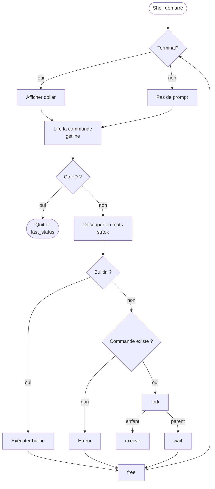

# Project: simple_shell

A simple UNIX command interpreter written in C, made as a project at Holberton School. It handles basic command execution, builtins, and PATH resolution, nothing more and nothing less.

---

## Requirements

- Ubuntu 20.04 LTS
- GCC
- Standard: `gnu89`

---

## Compilation

```bash
gcc -Wall -Werror -Wextra -pedantic -std=gnu89 *.c -o hsh
```

---

## Usage

### Interactive mode

Launch the shell and type commands directly:

```bash
$ ./hsh
$ /bin/ls
$ exit
```

### Non-interactive mode

Pipe commands straight in:

```bash
$ echo "/bin/ls" | ./hsh
```

---

## Command examples

```bash
$ /bin/ls
AUTHORS  README.md  builtins.c  executor.c  parser.c  path.c  shell.h  simple_shell.c  hsh

$ exit
$
```

---

## Man page

```bash
man ./man_1_simple_shell
```

---

## Valgrind

Check for memory leaks:

```bash
echo "/bin/ls" | valgrind --leak-check=full ./hsh
```

---

## How it works



The shell checks if it's running in a terminal. If yes, it prints a `$` prompt. Either way, it reads input with `getline`. On `Ctrl+D`, it exits cleanly. Otherwise, it tokenizes the input with `strtok`, checks for builtins (`exit`, `env`), and if none match, looks up the command via `PATH`. If found, it forks the child calls `execve`, the parent waits. Memory is freed, and the loop starts over.

---

## Contributors

- **Adam** — [github.com/Adamzou-lab](https://github.com/Adamzou-lab)
- **Noham** — [github.com/nohamoulma-hub](https://github.com/nohamoulma-hub)
